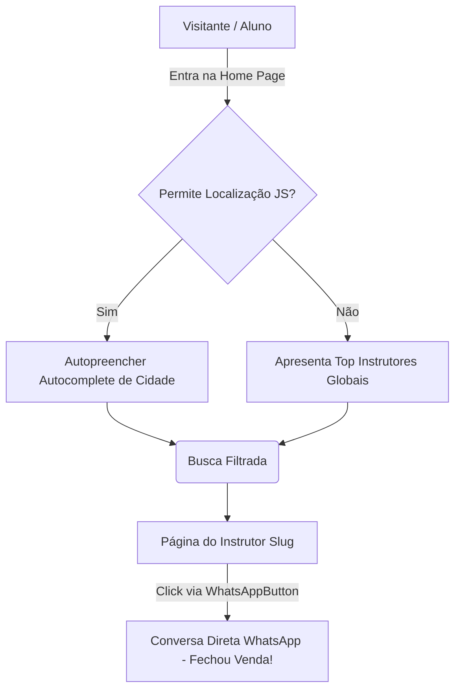

# 1. Visão Geral e Arquitetura do Projeto Voltz

## 🎯 O Propósito da Aplicação
A **Voltz** é um ecossistema digital ("marketplace") elaborado para conectar **Candidatos a Motoristas** (alunos) diretamente a **Instrutores Autônomos de Trânsito**. Seguindo o modelo das novas legislações de trânsito que permitem instrutores atuarem via CNPJ, a Voltz moderniza e barateia o processo de obtenção e treino de CNH.

## 👥 Tipos de Atores (Entidades de Usuário)
1. **O Aluno (Visitante Anônimo)**: O foco da conversão. Não precisa criar conta ou realizar login. Ele explora o catálogo usando filtros pesados (Carro Automático, Categoria B, Faixa de Preço e Bairro). Quando encontra seu instrutor, a quebra da fricção o leva direto ao **WhatsApp**.
2. **O Instrutor Autônomo**: Perfil Profissional. Precisa criar uma conta (Login/Registro). Após se cadastrar, ele tem um Painel Logístico Privado (`/painel`) para definir os valores da sua hora/aula, carros usados, zonas de atendimento (em KM) e gerenciar os documentos exigidos. Inicialmente fica `em_analise` até ser homologado.
3. **O Administrador (Root/BackOffice)**: O usuário mestre (role: `admin`). Através do endpoint protegido (`/admin`), a central da Voltz aprova as certidões ou repudia cadastros irregulares (Suspender / Aprovar). Somente instrutores "Aprovados" ganham sinal verde para aparecerem no Front-End público.

## 🏗️ Arquitetura Macroscópica
A Voltz adota um modelo operacional moderno **Serverless Stack**:
- **Front-End e Orquestração Renderizada**: Hospedado sob as asas da **Vercel**, rodando o framework **Next.js 14**. Toda parte de rotas e re-rendirização SSR garante que a Home Page carregue como um foguete para Mobile e os robôs de busca Google não encontrem bloqueios.
- **Banco de Dados e Authentication**: Não temos um servidor rodando Express/Node. Gastos com isso seriam insanos. Utilizamos o **Supabase** (Postgres Gerenciado). O Front-End consome diretamente a API RESTFul debaixo do panho e toda a proteção computacional é movida do node.js para o RLS (Políticas Ocultas de Segurança do SQL).

## 🗺️ Fluxograma Lógico Cidadão-Instrutor (Arquitetura)

## 🔐 Camada de Segurança Jurídica (Isolamento PII)
Um diferencial chave da infraestrutura do Voltz é manter o compliance estrito com a **LGPD (Lei Geral de Proteção de Dados)**. 
- A tabela `instrutores` que rege os resultados públicos carrega dados frios: _Id, Nome, Avatar_ e _Estatísticas_.
- Dados delicados como **CPF, RG, Certificado Senatran Bruto** foram dissecados e trancados em uma tabela independente `instrutores_dados_privados`, onde uma matriz de permissões PostgreSQL assegura que nenhum dev curioso via Client consiga sequer consultar no Postman o CPF de algum professor da rede sem portar o token criptográfico master de Admin ou ser o próprio dono.
