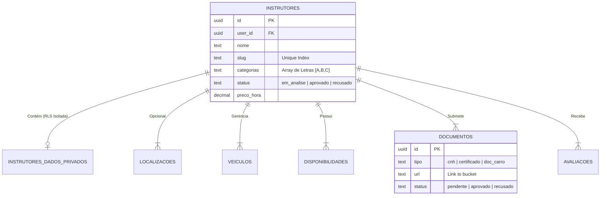

# 3. Backend e Bancos (Supabase e SQL Mapping)

Seja bem-vindo ao âmago de dados da plataforma Voltz. O sistema repousa nativamente sob o ecossistema do PostgreSQL da matriz Supabase.

## 🗺️ Mapa Completo Relacional do SQL (Schema)
O Schema principal obedece a uma lógica de "1 Instrutor -> Multitarefas Paralelas".



## 🛡️ A Fortificação Base: Row Level Security (RLS)
Sempre que for modificar, nunca crie permissões na lógica Frontend (JS), e sim use T-SQL Policies no Supabase Dashboard. 
**Exemplo Operacional Real:**
Como o front-end apenas dispara instâncias base `{ supabase.from('instrutores').select() }`, como impedir um instrutor malicioso de hackear as "Métricas de Avaliações" dele e colocar `nota: 5` usando cURLs mascarados?

As avaliações são engessadas por um POLICY.
- **Inserir (Candidatos)**: `CREATE POLICY "avaliacoes_inserir" ON avaliacoes FOR INSERT WITH CHECK (true);`
- **Atualizar/Apagar (Apenas Admin)**: Sem Policy pública declarada para `UPDATE` ou `DELETE`, o usuário anon ou autenticado (instrutor local) receberá erro 403 Forbidden pelo PostgREST, protegendo as reviews contra falsificações de lojistas, similar a estrutura de Trust Pilot da internet.

## 🪣 O Motor de Blob (Storage Protocol)
A aba lateral Storage do Supabase coordena dezenas de megabytes fotográficos da plataforma sob duas óticas de balizamento:
1. Bucket `fotos`: **Pública e de Cachê Agressivo.** Tudo que cai nessa pasta pode ser servido ao infinito por um link CDN global. As fotos dos Avatares/Rostos.
2. Bucket `documentos`: **Reservada e Perecível.** PDFs, Imagens de CNH frente e verso. Nenhum link dessa pasta deve ser público. O JS usa funções assíncronas `supabase.storage.createSignedUrl(caminho, 3600)` para gerar um link que só fica de pé por 60 minuntos no Admin Panel.

## 💡 O Famoso `mapInstrutorFromDB` (No db.ts)
Devido ao SDK Nativo do Supabase forçar em respostas relacionais tudo dentro de "Arrays", nosso código do Next.Js passaria extrema difuldade ao tentar invocar `instrutor.localizacao.cidade` com Typescript xingando que é um "Array Potencial".

Para normalizar o caos, todo pedido passa em `/lib/db.ts` no `mapInstrutorFromDB()`. Onde esmagamos arrays garantindo uma leitura impecável:
```typescript
// db.ts 
const loc = row.localizacoes
const locData = Array.isArray(loc) ? loc[0] : loc
// Fica fácil consumir no layout: instrutor.localizacao.bairro
```
