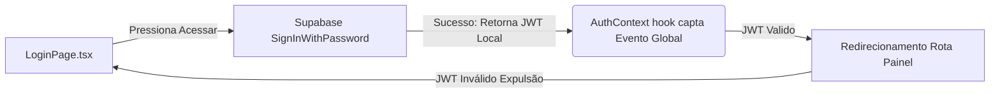

# 4. Auth, Fluxo de Dados e Middlewares

Não basta que Front e Back conversem se o estado do que acontece não foi gerenciado de maneira previsível para UX no Client. Aqui descrevemos o ciclo de vida do Session Token.

## 🔑 A Context API (useAuth)
O arquivo `AuthContext.tsx` é a casca grossa (O Proxy) da sua aplicação perante o usuário.

### Por que usar esse Provider Global?
Gera o estado principal para que TODO o site mude seu comportamento sem refetches caros. Exemplo: 
- O menu (`Navbar`) se autodesenha se o Contexto tiver o status `isInstrutor` ativo e plota a Tag verde *"Você está online"*. E condensa o Botão Login se tornando "Sair".
- Um admin master entra e o Contexto reage `role === 'admin'`. O botão *"Gerenciar Admin"* surge no Header escondido.

## 📝 Gestão dos Componentes "Client" vs "Server" do Next.js
- Atualmente, quase tudo opera com `"use client"`. Por quê? Porque lidamos com **Buscas interativas**, **Formulários Assíncronos** e integrações agressivas com Auth do Supabase JS que usa `sessionStorage` persistente em client-side browser.
- Todo arquivo "page" enraizado em `/src/app/` apenas funciona como invólucro (Wrapper) das montagens grandes que existem dentro dos "Components/Pages". É lá onde as engrenagens client ficam instaladas.

## 📸 Fluxograma Burocrático de Subida de CNH
Sabe por que a infraestrutura de Segurança do Painel de Admin / Perfil do Instrutor impressiona nas avaliações? Todo item se quebra. 

1. O Instrutor tira a foto da CNH e sobe. File vira blob.
2. `storage.ts` encapsula a API com `uploadDocumento()`.
3. Supabase emite url Assinada.
4. `db.ts` é acionado para criar um Insert novo na tabela `documentos` e **A mágica:** Adiciona o `tipo='cnh'` com `status = pendente`.
5. Se a foto for Ilegível, o admin não precisa cancelar o perfil. Ele reage clicando em RECUSAR o Doc CNH e escreve `motivo="Foto Mofada"`. O Instrutor vai abrir o perfil dele com tudo lindo em volta e apenas o doc com badge vermelho e o botão de re-upload livre pra usar.
